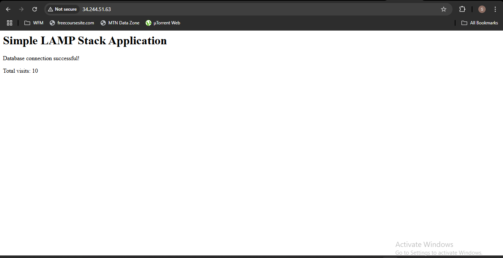

# Terraform LAMP Stack on AWS (3-Tier)

This project provisions a 3-tier LAMP (Linux, Apache, MySQL, PHP) stack on AWS using Terraform. It includes modular infrastructure-as-code components for VPC, EC2, RDS, and Security Groups.

## Live Application Link:

```
  http://54.74.200.95
```



## ✅ Architecture

- **Region:** eu-west-1
- **Web Tier:** EC2 in Public Subnet (Apache + PHP)
- **DB Tier:** Amazon RDS MySQL in Private Subnet
- **No App Tier EC2 (skipped for simplicity and cost)**

## 📁 Structure

```
lamp-terraform/
├── main.tf
├── provider.tf
├── variables.tf
├── outputs.tf
├── terraform.tfvars
├── modules/
│   ├── vpc/
│   ├── ec2/
│   ├── rds/
│   └── security/
```

## ⚙️ Configuration

### terraform.tfvars (example)

```
key_name            = "your-keypair-name"
db_username         = "Your-Database-Username"
db_password         = "Your-Database-Password"
github_app_repo_url = "https://github.com/mr-robertamoah/simple-lamp-stack.git"
my_ip               = "X.X.X.X/32"  # Your public IP with /32 CIDR
```

### VPC CIDR Blocks (updated to avoid conflict)

```
VPC:                 10.20.0.0/16
Public Subnets:      10.20.1.0/24, 10.20.2.0/24
Private Subnets:     10.20.101.0/24, 10.20.102.0/24
```

## 🔒 Security Groups

- **Web SG**: Allows HTTP (80) from 0.0.0.0/0 and SSH (22) from your IP
- **DB SG**: Allows MySQL (3306) from Web SG only

## 🧰 User Data Script (EC2)

Installs LAMP stack, clones the PHP app, injects RDS DB credentials, and sets up CloudWatch and SSM Agent.

DB credentials are automatically populated in `.env` based on Terraform variables.

## 🚀 Deploy

```
terraform init
terraform validate
terraform plan
terraform apply
```

## 🧹 Clean Up

```
terraform destroy
```

## 📝 Notes

- Ensure your GitHub repo is **public** or accessible without authentication.
- The `.env` file in your app is overwritten with DB connection details.
- Amazon CloudWatch and SSM agent are installed for monitoring.
